# My Favourite Recipes

## Project Outline
The purpose of this project is to build a full-stack site that allows users to manage a set of data using HTML, CSS, JavaScript, Python+Flask, MongoDB and external API's. This site is a personal recipe site where favourite recipes can be uploaded and shared with other site visitors. These recipes can be family heirlomes handed down throught the generations or new favourites found in a magazine, book, online or even recommended by a friend or family. A database will be used to hold the recipes with a search function. To be able to add recipes to the site a user will need to register and create login credentials.

 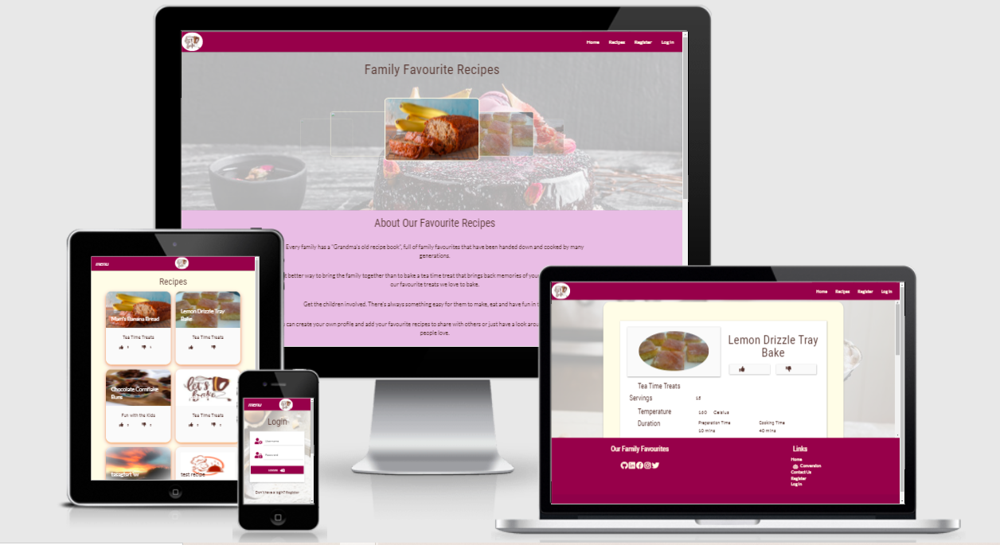

[View the live project here](https://our-family-favourites.herokuapp.com/)
## Design Phase
### User Experience
######  User Story 1:   Recipe Details
**As a** visitor, 
**I want** to find some tasty and fun recipes
**So that** I can quickly and easily bake something tasty for family and friends
**Given** a visitor is interested in baking,
**When** they visit the site and open a recipe,
**Then** the recipe should have all the information needed to create the dish and be clear and easy to follow.
######  User Story 2:   Favourites
**As a** visitor, 
**I want** to know if other people like the recipe
**So that** I am confident I will enjoy it too
**Given** people have different likes and dislikes,
**When** eating food,
**Then** the site needs to have the ability to like or dislike the recipes and this information needs to be displayed clearly.
######  User Story 3:   Contact
**As a** visitor, 
**I want** to be able to contact the organisation
**So that** when I have a question or something is wrong
**When** using the site,
**Then** a confirmation email should be sent to the visitor.
######  User Story 4:   Registration/Login
**As a** visitor, 
**I want** to know my account is secure to me
**So that** I am confident noone else will be able to access my recipes
**Given** that passwords need to be create,
**When** a new account is registered,
**Then** the new password needs to be confirmed and encrypted to reduce the risk of hacking and this password is then used to log into the account.
######  User Story 5:   Upload Profile
**As a** visitor with an account, 
**I want** to be able to add an avitar or image of myself or change my password
**So that** I know I am on my own profile and I can keep it more secure
**Given** it will make the account more personal,
**When** on the profile page
**Then** there needs to be an upload image and change password facility on the profile page.
######  User Story 6:   Add Recipes/Categories
**As a** visitor, 
**I want** to be able to add my own recipes and categories
**So that** I can share them with family and friends
**Given** the visitor has registered, creating a profile,
**When** logged in,
**Then** the visitor can create, read, update and delete recipes from a single location as well as having the ability to create, read and update categories if none of the current categories meet their requirements.
######  User Story 7:   Upload Images
**As a** visitor, 
**I want** to be able to upload an image of my recipes
**So that** other people and I can see the product without having to read
**Given** it is easier to scan images than words,
**When** looking for a recipe,
**Then** the add and edit recipe pages need to have an upload image fascility.
######  User Story 8:   Delete Account
**As a** visitor, 
**I want** to have the ability to delete my account and my recipes from the site
**So that** I know the site is compliant with GDPR
**Given** the recipes belong to each visitor when they are loaded onto the site,
**When** they wish to close their account,
**Then** the recipes must also be deleted because they could be classified as personal information.

### *Strategy*
A site where recipes can be loaded and shared by individuals creating a central repository where anyone can try something new or bake something that brings back child hood memories of being in Grandma's kitchen. The site will help remove the need for a book shelf full of cookery books. Thereby saving space, reducing clutter and creating a quick easy way to find something tastey to bake.

### *Scope*
[Project Design Mind Map](static/documentation_files/images/recipes_mindmap.jpg)

The features to be included are
* The ability to select recipes by category
* The ability to create a profile which will allow the user to add/update their own recipes and contribute to the site
* The ability to download a recipe and/or email a recipe but only if the user has an existing profile
* If a user with a profile wishes to delete their account, the ability to decide if they want to delete their contribution

#### Weights and Measures
As the site developed I decided to not create my own weights and measures page. The idea was to allow the website user to convert ounces to grams or celsius to gas marks etc,  without having to search around the internet separately. I realised what I wanted to do would be a whole website in its own right when I looked at the BBC Good Food website's very comprehensive area for many different types of conversions. Since this site should represent a corporate site I decided leaving the link in the footer was not appropriate. I personally like pounds and ounces, my daughters like grams and the American cup measurements. 

### *Structure*
How is the information structured, and is it logically grouped?
The navigation bar will change depending on the type of user visiting the site. 
Someone who does not have a profile will only be able to view the recipes and have the ability to register and login.
Someone who is already registered will 
* have the ability to see all the recipes they have created on a profile page
* have the ability to add, change or delete any of the recipes they have contributed 
* have the ability to delete their account 
* be able to print and/or email any of the recipes on the site

There will be the ability to select the recipes by category or for all categories. 
The categories will include 
* Fun with the children
* Tea time treat
* Special occasion
* What's for dinner
Recipes will be displayed in a card with an image of the final product. Clicking on the card will display all the ingredients, method, times, equipment etc and if the user is a registered user, the ability to download and/or email the recipes

### *Skeleton*
#### Wireframes
[Mobile Wireframs](static/documentation_files/mobile.pdf)

[Tablet Wireframs](static/documentation_files/tablet.pdf)

[Desktop Wireframes](static/documentation_files/desktop.pdf)

[Database Schema](static/documentation_files/recipe_db.png)
### *Surface*
I used Materialize to assist in the design of the website [Materialize](https://materializecss.com/)
I created a colour palette using the [background image](static/images/puratos_tropical_fruit_cake.jpg) and [icolorpalette](https://icolorpalette.com/). I then used the [Materialize Colours](https://materializecss.com/color.html) to decide on the actual colours for this site.
[Image with main colour pallet](static/documentation_files/image_colour_pallet.pdf)
[Full colour pallet](static/documentation_files/full_colour_pallet.pdf)
finished product
styling, balance, consistency

### Features
####    Header Navigation Bar
The navigation bar changes dependant on whether the visitor is logged in or not.
######   Not logged In
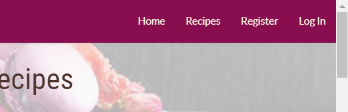
######  Logged In
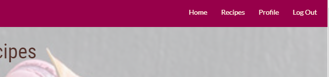

On smaller devices the navigation changes from individual links to the standard hamburger symbol with a dropdown side bar menu
######  Hamburger Symbol and Side Bar Menu
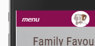
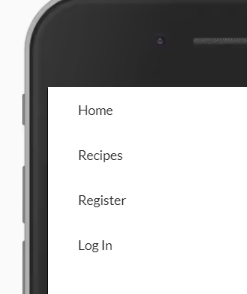
####    Footer Area
The footer area has active links to my personal social media site.

####    Landing Page
The landing page is split into 3 separate areas.
######  Home Section

This section has a carousel of all the recipes available on the site. If a visitor selects one of the images they will be taken to the recipe detail page.

######  About Section
The about section gives some background to the reasons behind the site.

######  Getting Started Section
On the getting started section a visitor is invited to join the site and start adding their own recipes.
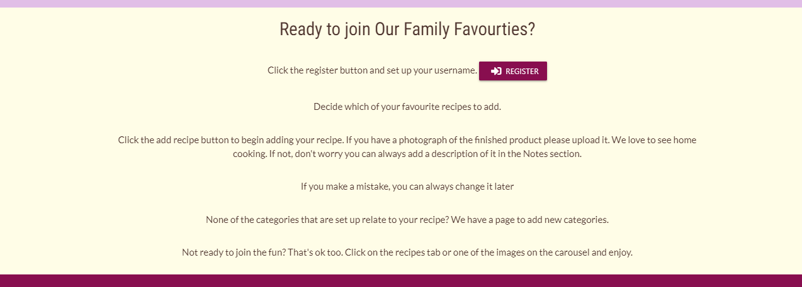
####    Recipes Page
The recipes page is a list of all the recipes, each displayed on their own card. When the recipe card is clicked on the recipe detail page is loaded so the website user can start making the recipe.
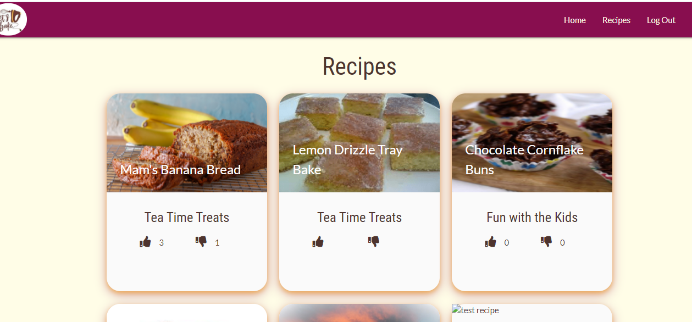
####    Recipe Detail Page
The recipe detail page has all the information needed to create the dish. The website user can like and/or dislike the recipe whether they have a profile or not. 

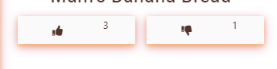 

If the website user has already liked or disliked the recipe they cannot like or dislike it again and a flash messages appears.
**liked**
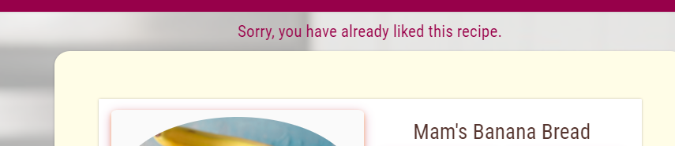
**disliked**

If the website user has a profile and they orginally added the recipe edit and delete buttons will show at the bottom of the recipe on the recipe detail page which is a view only page. Clicking on the *edit* button will take the website user to the edit recipe page and clicking on the *delete* button will take them to the delete recipe confirmation page.
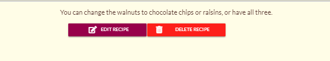
####    Register Page
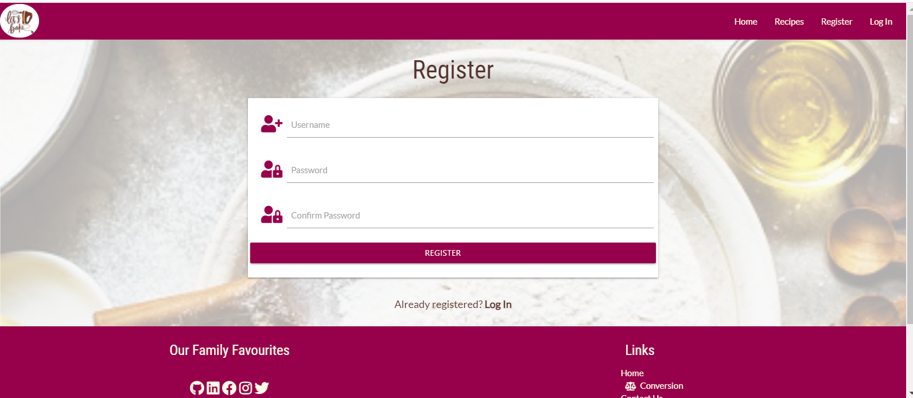
The website user needs to register to be able to add any new recipes or categories. Subsequently they will be able to perform full CRUD functionality on their profile and the recipes they ahve added. They will not be able to delete the categories because other website users may have used the category for their own recipes. Only "admin" will be able to delete a category and only if there are no recipes allocated to that category.

1. The individual needs to decide on a username and password. Both can consist of upper and lowercase letters and numbers and must be between 5 and 15 characters in length. 
If the username is too short the entry line changes to red and when the cursor is hovered over the line the message "Please match the requested format." appears. 
* Here the username is too short

* Here the user wanted to use special characters which are not allowed.

* The user has entered a valid username and the HTML formating has stopped the user entering more than 15 characters.
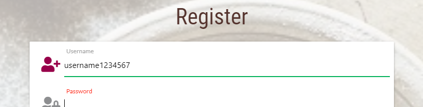
* If the user selects a username that already exists the receive a flash message
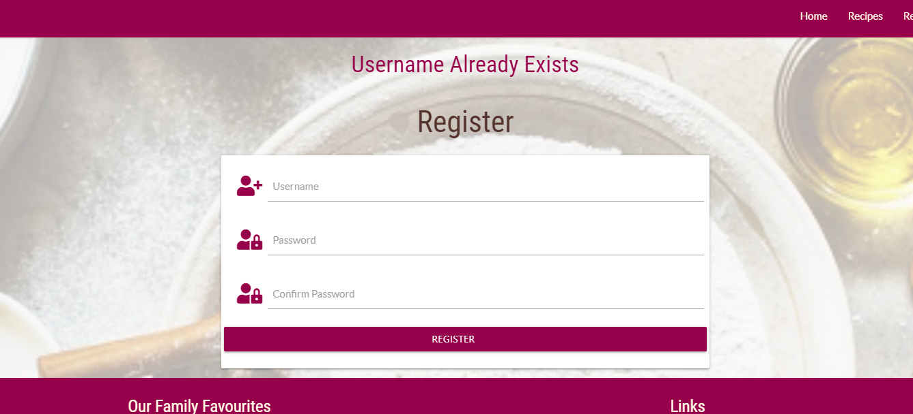
2. Both passwords must be identical. 
* Here the passwords do not match and a flash message is displayed.

3. If a user already has an account they can click the link to take them to the log-in page.

4. When the website visitor creates a valid username and password, the password in encrypted using Flask Werkzeug security, a record is added to the user collection in MongoDB and the user is taken to their profile page.
* MongoDB record
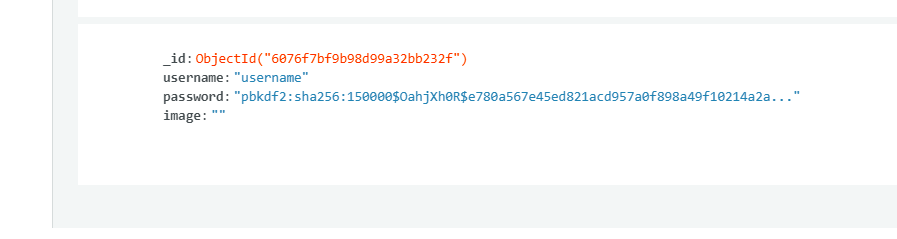
* Profile page of a new account

####    Login Page
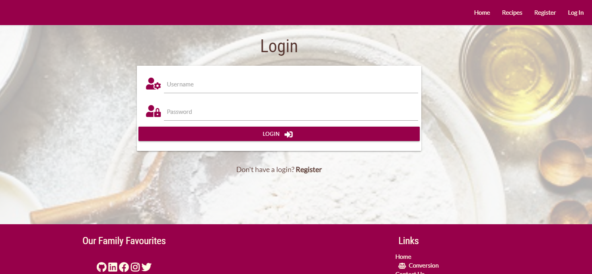
Once the website user has an account they can log in and out whenever they need.
1. The username and password are validated against the user collection in MongoDB to confirm the username exists and its password is correct.
* If the user enters either an invalid username or incorrect password a flash message is displayed. The same message is displayed for both errors to help prevent hacking.
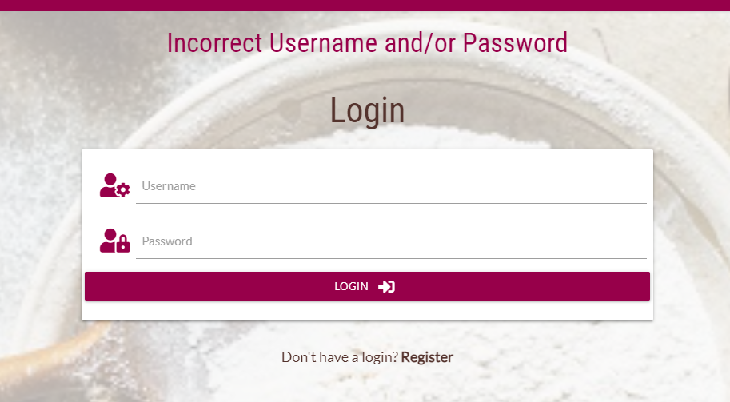
3. If a user is not register there is a link to the registration page.
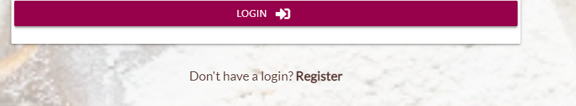

####    Logout Option
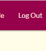

When the website user clicks on the Logout option they are taken back to the Login page.

####    Contact Us Page
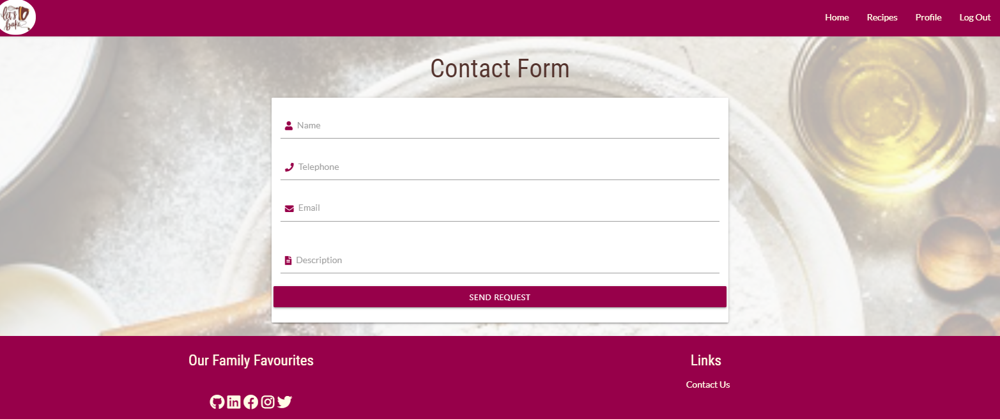
This contact page allows the website user to email the website owner with any questions, concerns or observations. When the website user clicks the button, it sends an email to the website owner and a reciept confirmation email to the email sender.

####    Profile Page
The profile page has two sections
    **profile detail**
     The website user can upload an image for their profile id, change their password or delete their account. 
     If they choose to delete their account all the recipes they have added to the site will also be deleted.
     **recipe and category**
     The website user can create new categories and add recipes. They are only allowed to make changes to their own categories and recipes. If a website user clicks on the recipe name they will be taken to the recipe detail page where they will be able to choose to edit or delete the recipe.
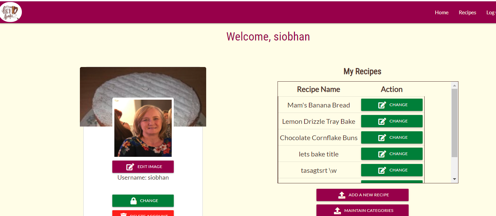
Below is an image of the profile page for a new user which shows a message saying they have not added any recipes and has a place to upload an image of themselves if they want to.

####    Add Recipe Page
As the name suggests this is the page where the website user can add a recipe. 
**N.B.** If the website user wants to add an image they should do this before entering all the other details for the recipe. If they do this after the recipe details disappear. I have added this to future improvements. 

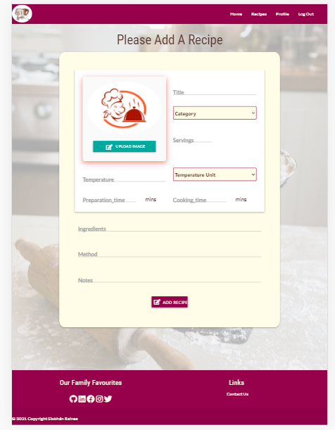

####    Change Recipe Page
For UX I have kept the format of the Change Recipe page the same as the Add Recipe page. This page allows the website user/recipe authoer to change or delete the recipe, or to cancel the action. All actions return the website user to the Profile Page and a flash message appears if they have changed or deleted the recipe.
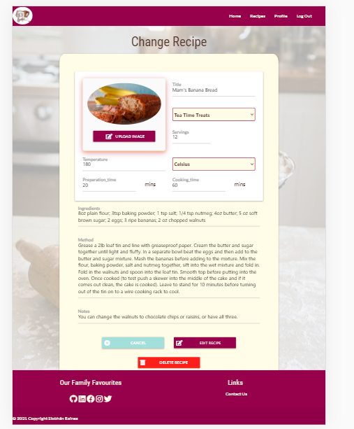

####    Add Category Page
To reach the Add Category Page the website user needs to select the Maintain Categories from the Profile Page. At the top of the screen is an Add Category button.

The Add Category page is very simple. It just allows the addition of a text format category. With more time I wanted to add a search/filter feature to the recipes page.

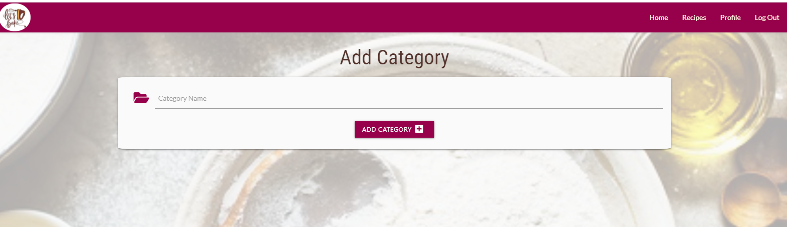

####    Categories Page
This screen allows the website user to add or change categories they own. Only "Admin" can delete the categories. A category cannot be deleted if it is attached to a recipe. 
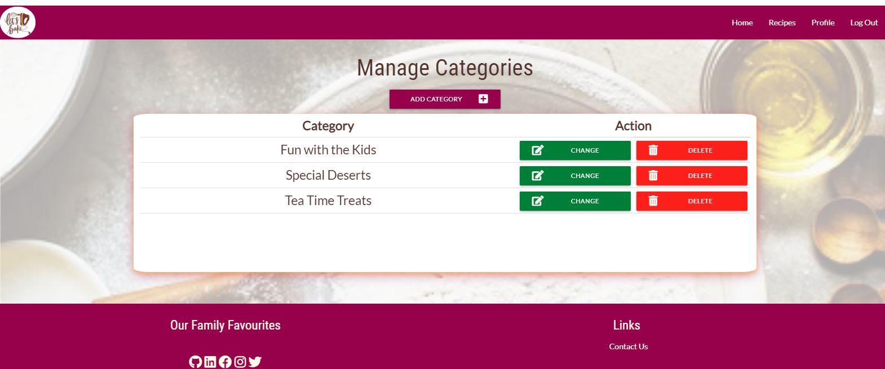

####    Edit Category Page
The website user can only change the category or cancel the action
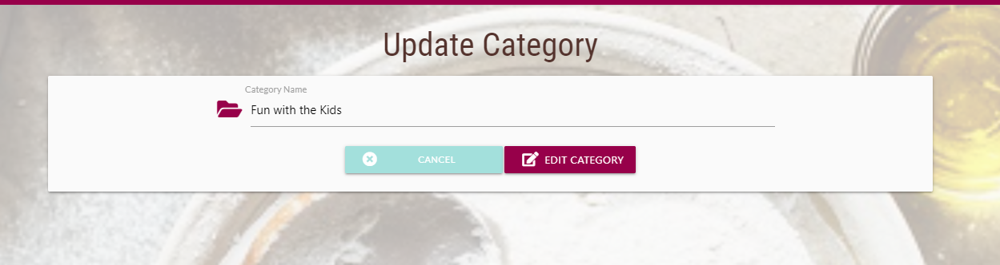

####    404 Page
If at any point the links break a 404 page will appear directing the website user back to the home page.
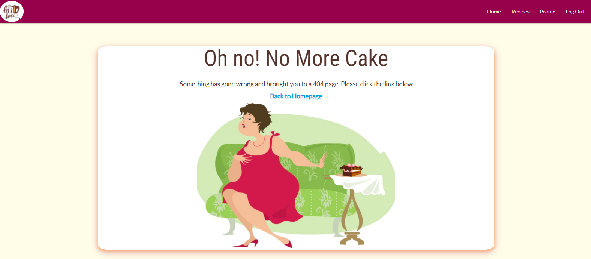

###     Media

####    Technologies Used

MongoDB was used as the database for the recipes and accounts. 
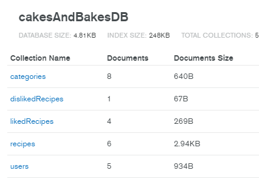

Heroku was used for deployment and version control 
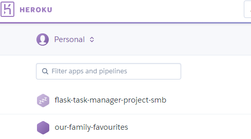

####    Credits 
*Where an image is not listed it is my own.*
**icon**
[icon](https://stock.adobe.com/uk/search/free?load_type=search&native_visual_search=&similar_content_id=&is_recent_search=&search_type=autosuggest&k=baking&acp=0&aco=baking&asset_id=273670969&content_id=273670969) Let's Bake motivational slogan or phrase handwritten with calligraphic font or script and decorated by mixer By Good Studio 
**background for static pages**
[background flour](https://stock.adobe.com/uk/search/free?load_type=search&native_visual_search=&similar_content_id=&is_recent_search=&search_type=autosuggest&k=baking&acp=0&aco=baking&asset_id=178084081)baking ingredients By Rawpixel.com
**background for weights & measures page**
[background scales ](https://stock.adobe.com/uk/search/free?filters%5Bcontent_type%3Aphoto%5D=1&filters%5Bcontent_type%3Aillustration%5D=1&filters%5Bcontent_type%3Azip_vector%5D=1&filters%5Bfree_collection%5D=1&filters%5Bcontent_type%3Aimage%5D=1&filters%5Borientation%5D=vertical&k=baking&order=relevance&safe_search=1&search_type=filter-select&get_facets=1&asset_id=247706319) Rolling pin and a weighing scale By Rawpixel.com
**Default Profile Image**
[chef](https://www.vectorstock.com/royalty-free-vector/abstract-chef-cooky-food-bakery-logo-design-icon-vector-24016199) Image Id 24016199 ARTIST [adhevaart](https://www.vectorstock.com/royalty-free-vectors/vectors-by_adhevaart) 
**Landing Page Image**
[home](https://www.bakemag.com/articles/14570-spring-on-the-wild-side-with-cakes) Image courtesy of Puratos by [John Unrein](https://www.bakemag.com/authors/2-john-unrein) 04/07/2021

######  Recipe Images
Although I may have some photographs of the cakes and bakes created by the recipes I decided it would be more time efficient to images that are available on the internet. 
*[Chocolate Chip Cookies](https://www.google.com/search?q=chocolate-chip+cookies&rlz=1C1CHBF_en-GBGB927GB927&sxsrf=ALeKk00CvGruX48K4p1I096wLH3I9PnZvA:1616684868489&source=lnms&tbm=isch&sa=X&ved=2ahUKEwjPxbK63MvvAhUOQxUIHYBSCmYQ_AUoAXoECAEQAw&biw=1280&bih=554&dpr=1.25#imgrc=RCL0CE6FPWbCyM)
(c)Handle the Heat with Tessa Arias. 
*[Lemon Drizzle](https://100cookbooks.wordpress.com/2012/08/18/lemon-drizzle-traybake-mary-berrys-baking-bible/)
*[Banana Bread](https://www.pcrm.org/good-nutrition/plant-based-diets/recipes/banana-bread) (c)The Vegan Starter Kit by Neal Barnard, M.D.
*[Chocolate Cornflake Buns](https://i.pinimg.com/originals/6c/6e/1f/6c6e1f6f9c81bb8ddc90484a3db683f2.jpg) (c)netmums.com via pinterest.co.uk
*[Upside Down Berry Cake](https://images.immediate.co.uk/production/volatile/sites/2/2014/12/1654.jpg?quality=90&crop=1px%2C353px%2C597px%2C254px&resize=597%2C254) (c)Olive Magazine

### Profile card
My mentor, Arnold Keyza, suggested looking at the profile cards on [codepen](https://codepen.io/). I copied the code for [Randome Doodle2](https://codepen.io/thefeldkircher/pen/mdReELp) by [thefeldkircher](https://codepen.io/thefeldkircher) and modified it to be how I wanted it to look. 

## Development Phase
### Logo image in Navbar
I want to use the image  in the Navbar as a logo. When I added the image `` it appears to cover the whole page 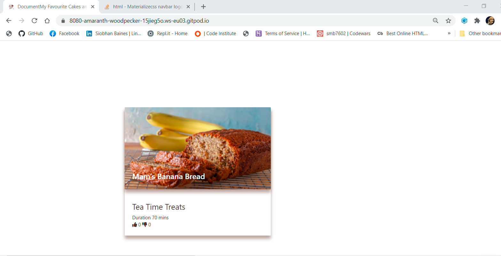 I googled *add image for icon navbar materialize* and found some code in [stackoverflow](https://stackoverflow.com/questions/51412303/materializecss-navbar-logo-image-position)which still didn't give me what I wanted but after some playing in dev tools I got the icon where I wanted it.
 
### Error when trying to run app from Heroku
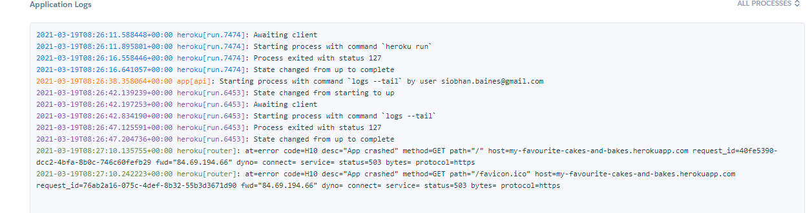
I had a look on Google for the error code but found nothing. I then looked on Slack and couldn't find anything to help. In the end I contacted Tutor Support who asked me to look at my Procfile which was fine and then asked me about how it was deployed. I'm using the automatic deployment through GitHub. He then had a look and found the app wouldn't run on GitPod either and informed me there is a syntax issue in my Python code. I did do a quick commit and push last night before I could finish what I was doing because I had an online yoga class and was running out of time. The error was a missing 's' of methods.

### Recipe would not Add when Add button clicked

When I created the Add Recipe page I based it on the Recipe Details page for the layout and copied the functionality from the Add Category page. After some digging I decided to put the code through the HTML validator [http://validator.w3.org/](http://validator.w3.org/) I had checked all my opening and closing tags so was surprised by the 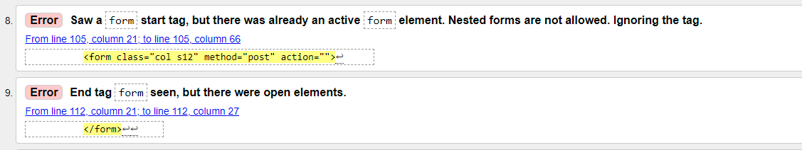 The words **Ignoring the tag.** made me realise I cannot have forms within a form. I had used the Materialzecss TextArea code for 3 of the elements that needed to be entered. I changed the TextArea's to standart input elements of the type text. This time the recipe was added to the recipes collection in Mongodb.
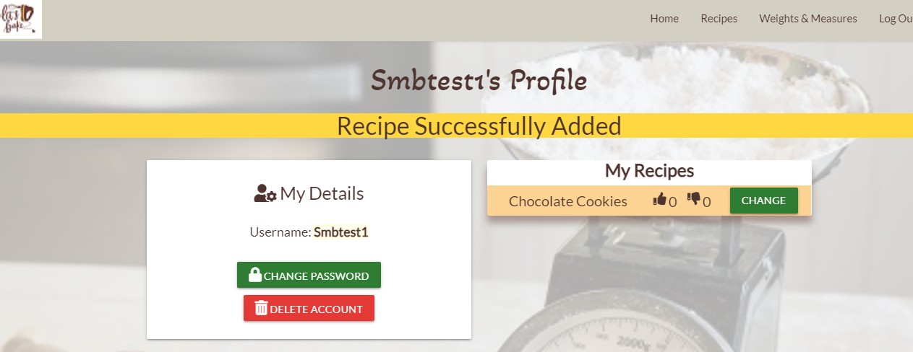

### Ingredients, Method and Notes not showing on Update page
These 3 fields load fine on the recipe detail page but do not appear on the update recipe page. I can see the cooking time which is currently a string value but not the ingredients, also a string value.
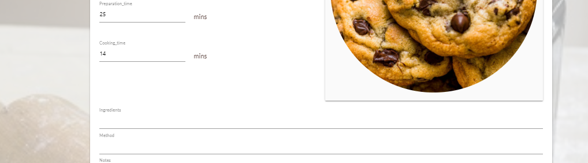
I checked the HTML and changed these fields to a materialize textarea. No change. I then checked the rows and column divs lined up properly. I checked the database to make sure there was nothing odd about the collection elements.

I asked for help on Slack and acted on the advice given. Eventually I gave up for the night. The next day I contacted tutor support and had another dig around Slack to see if there was anything that might point me in the right direction. This made me review the code I had copied from Materialize
In the end it was a rookie mistake. I had copied some JavaScript code from Materializecss and initialised the value with blanks. When I commented out the JavaScript the ingredients, method and notes all reappeared. At this time regression testing has not brought up any related issues.
##  Future Improvements
* When a user registers or logs in better messages could be created allowing the user to know the format required for the username and password.
* Only allowing 3 attempts to log in before requesting the user to change their password
* Forgotten username and password facilities would be useful for users who have not been on the site for a while and have forgotten their credentials
* On the Add Recipe Page it would be better if there was a way to save the information on the page when the website user clicks on the upload image button. I don't really want it to create a full record of the recipe before the author is happy. That said when an image is uploaded a record is created in the recipe collection in MongoDB.

## Code Verification
[W3C validator](https://validator.w3.org/) is used to validate the HTML5 for all templates which brings up various errors because the HTML in base.html is imported into the other HTML templates at run time. This validator also does not like the jinja commands in the HTML templates
####    delete_account.html
Below shows the issues. Errors 1 to 3 all exist in base.html. Error 4 is because it is a jinja command
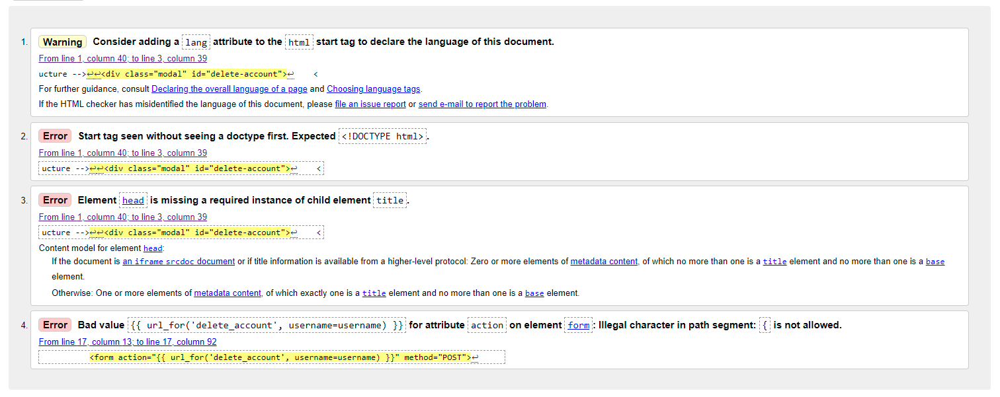
####    add_recipe.html
I put the *pattern* attribute into textarea because I have it for input text elements to stop hackers being able to enter code into the website. This is not valid so I will remove it from ALL textarea elements.
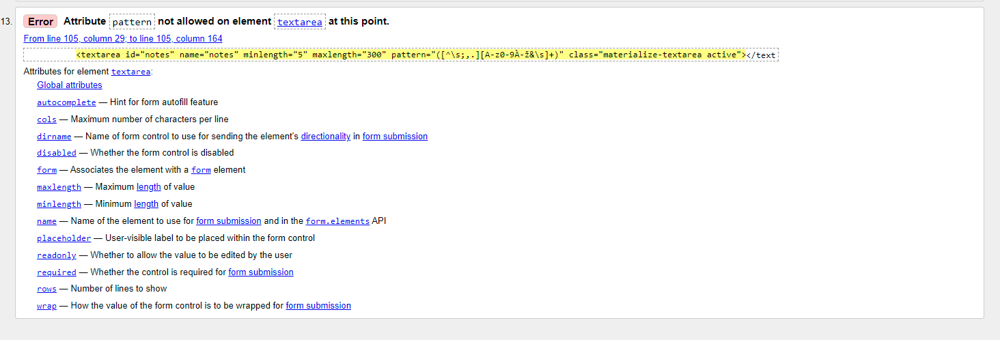

[CSS validator](https://jigsaw.w3.org/css-validator/validator)
This tool was used to validate the CSS script. 

[Autoprefixer](https://autoprefixer.github.io) which adds in any webkit or other extenders needed for different browsers

[JSHINT](https://jshint.com/) I used JSHint to check my javascript code.

## Testing and Deployment Phase

[Test Evidence](Test_Evidence.md)

### How to run the application from GitPod
Once the application has been opened in a GidPod workspace there are a couple of tasks that need to be performed to be able to run the application during development.
1. An **env.py** file needs to be created which needs to contain the configuration variables stored in Heroku.
2. The command >pip3 install -r requirements.txt` needs to be run to install all the external API's the application needs to be able to run.
3. To run the application use the command >python3 app.py` and then click the **Open Browser** button on port 8080. The application will appear in a separate browser tab.

### How to deploy to Heroku
1. create the requirements.txt document in GitPod using the command `pip3 freeze --local > requirements.txt`
2. create the *Procfile* which Heroku needs to know which file runs the app and how to run it using the command `echo web: python app.py > Procfile"`. Remember to open the Procfile and remove the blank line at the bottom if one exists because it can interfere with Heroku running the app.

3. In Heroku, 
    1. click on **New** and **Create new app**. 
    
    2. Create the app using lowercase letters, numbers and hyphans instead of spaces (NO special characters). Select the nearest region and click **Create app**
    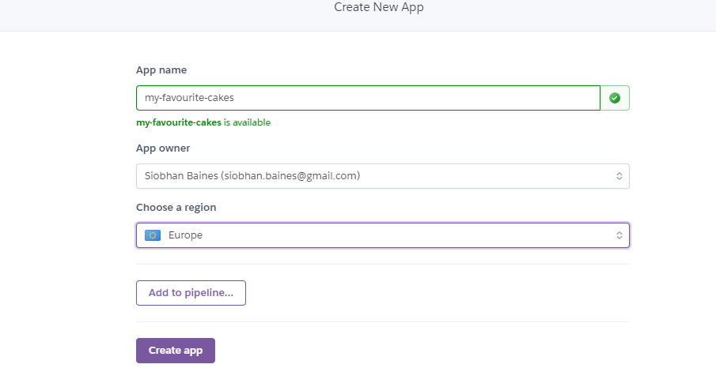
    3. Go to the **Deploy** tab to link Heroku to the correct GitHub repository
     and click **connect**
4. Set up the configuration variables that exist in `env.py` by clicking on the **settings** tab, scroll down to **Config vars** and click on the button.
.
5. Before clicking the deploy button make sure the `Procfile` and the `requirements.txt` files are deployed to Github
6. In Heroku click on **deploy** tab and click on **Enabled Automatic Deployment** and **Deploy**. 
7. Once it has deployed use the standard method of deploying to GitHub and this will be automatically replicated through to Heroku. 
    >git add .`
    >git commit -m"message"`   
    >git push`
    

