# My Favourite Recipes Test Evidence
## Unit and Functional Testing

####    Navigation
The navigation bar is consistent across all pages and device sizes.
#####   Main Nav Bar before logged in
 
#####   Main Nav Bar after logged in
 
#####   Hamburger Nav Bar on smaller devices
 
#####   Side Nav Bar on smaller devices
 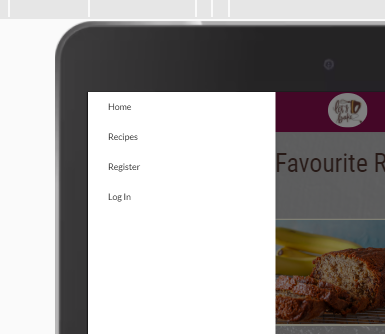

Each of the navigation links takes the webiste user to the relavent pages.

####    Footer
The footer allows for the addition of information and links to sites that are not directly part of this site. The website user can find information about the creator of this site. In the real world these links would be for other company information including corporate social media. The website user has access to be able to contact the owner of the site via the **contact us** link.

#####   Footer on Large Devices
 
#####   Footer on Medium Devices
 
#####   Footer on Small Devices
 
####    Github
The link to Github opens in a seperate window.
 
####    LinkedIn
The link to LinkedIn opens in a seperate window.
 
####    Facebook
The link to Facebook opens in a seperate window.
 
####    Instagram
The link to Instagram opens in a seperate window.
 
####    Twitter
The link to Twitter opens in a seperate window.
 

#####   Materialize Parallax Image
**Issues**
There is an issue when moving between device sizes where the home page, parallax image does not cover the whole of the container.

 

I tried to fix this by removing some of the CSS styling for the .parallax-container class so that it only contained the overlay to lighten the image which enabled the materialize CSS. Although this looked like it worked initially, when I reloaded and ran some more tests the issue stayed the same
**Resolutions**
After much investigation I have come to the conclusion this is an intermittent issue with the materializecss styling for the parallax class. I thought it was related to the carousel I have on top of the background image but found I have the same issue on other pages where there is no background image. something happens to change the element.style but I have not been able to uncover the exact issue.

 
 
 
 

####    Home Page
**Issues**
There is a strange issue with the home page where by when the site is opened on a desktop and all navigation is done on that resolution the navigation bar fits the whole window and there is no horizontal scroll bar.
 
If the same page is inspected using DevTools and then DevTools is closed a horizontall scroll bar appears.
**Resolutions**
 
To fix the issue I had to add some styling for the `.nav-extended` class to force the bar to being the full width and then had to add some padding to the right of the ul element so that all them navigation options were still visible.

####    About Page
The about page has no functionality to test but the format for UX needs to be validated across all device sizes.
**Issues**
There is an issue with white space on either side of the about container.
  
 **Resolutions**
This issue occured because the class container is a materialize class which has a set width that is smaller than the full view width of a screen. By changing the classes from .container .about to .container-about in both the HTML and CSS the issue is resolved.
 

####    Getting Started Page
The getting started page has one button which allows the website user to register with the site to allow them to add their own recipes. This button works.

 

####    Recipes Page
The recipe page will grow in length as more recipes are added. Clicking on one of the recipe cards will take the website user to the recipe detail page. Each recipe shows how many people have liked or disliked each recipe. 
#####   Recipes Page Large
 
#####   Recipes Page Medium
 
#####   Recipes Page Small
 
The recipe card page allows the website user to search recipes for specific categories. Here I used the word fun 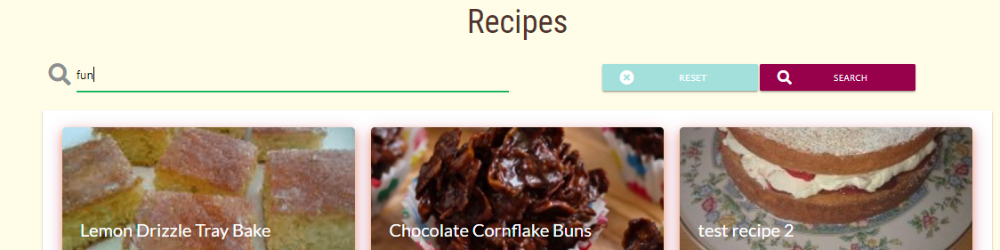 which brought back only one recipe 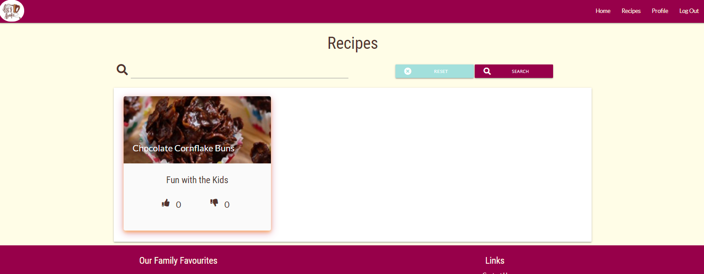

If a recipe is loaded without an image, the site provides a default image.

**Issues**
1. When an image is uploaded it will need to be resized so that when it is displayed the image does not pull out of shape.
2. If there is no image a default image is needed and the recipe title font colour will need to darken.
**Resolutions**
1. Using google to search for resizing of images using Python I found [auth0.com](https://auth0.com/blog/image-processing-in-python-with-pillow/#Resizing-Images)
2. Added default image code to HTML and added a new class with CSS to change the recipe title from white to brown so that it can be read.
 
####    Register Page
The website user needs to register to be able to add any new recipes or categories which they will subsequently be able to read, change or delete later.

 
####    Log-in Page
Once the website user has an account they can log in and will then have access to add, change, delete recipes and add, change categories.

 
####    Log-out
Logging out take the website user back to the login page.
###     Profile Page
When a website user has created an account and/or logged in they are taken to the profile page where they have full access to their account and recipes with only add and change access to their categories.
 
**Issues**
The text on the buttons on the profile card are truncated.
**Resolution**
I increased the button width from 12rem to 14rem.
From this page a website user can change their password, delete their account (which will delete all the recipes they have created), add a new recipe, maintain categories. When the website user has added some recipes a table is displayed detailing the recipes they have added. Clicking on the recipe name will take them to a read-only view of the recipe or they can click on the maintain recipe button to change or delete the recipe.

#####   Recipe Table
The recipes table scrolls horizontally on medium and small devices and vertically on large devices.
######  large

######  small
 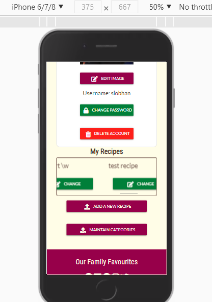

####    Display Recipe Page
This page shows all the details of the recipe so that the website user can cook it easily. The website user can also like or dislike the recipe.
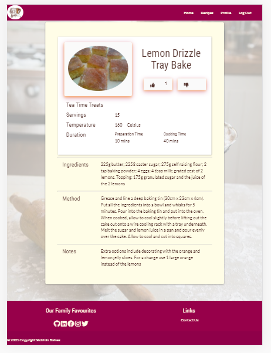
If the website user has already liked or disliked the recipe, a flash message is displayed and they cannot like/dislike it again.
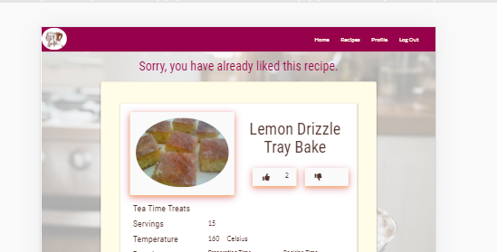
**Issues**
1. The the liked button was clicked but the website user was not logged-in the site crashed. This is because session does not have a user element unless a visitor is logged in. 

**Resolution**
I changed the code to include a test to check session for a user element. This has the effect of not allowing anyone who does not have an account from liking or disliking the recipes.
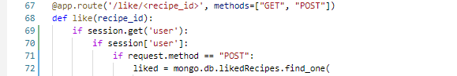
After some thought I decided the site would be more efficient if I made the change in the HTML. This would reduce the processing time of reloading the page. I changed the HTML to display two different types of buttons depending on whether the website visitor was logged-in or not. 
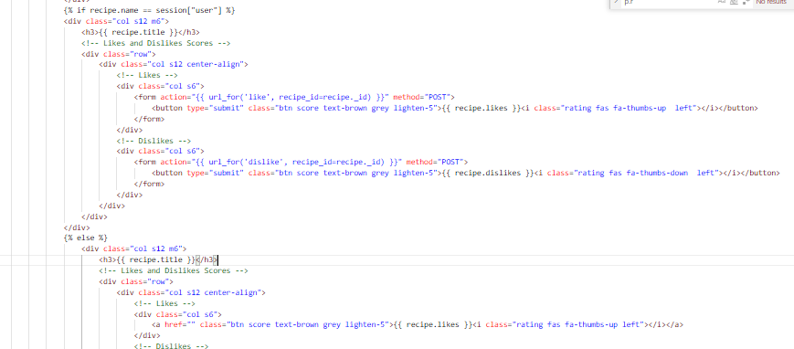 
I also changed the CSS to fix the alignment using flex-box on both the recipe detail and the recipe card pages.
 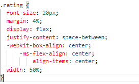 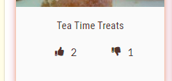 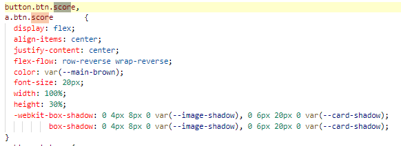 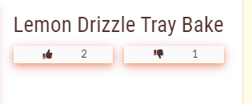

####    Add Recipe Page

If the website user wants to load an image, this needs to be done before the recipe details are filled in because the site currently loses all the other information when the upload button is pressed. The website use can change the recipe and upload an image then.
#####   Upload image
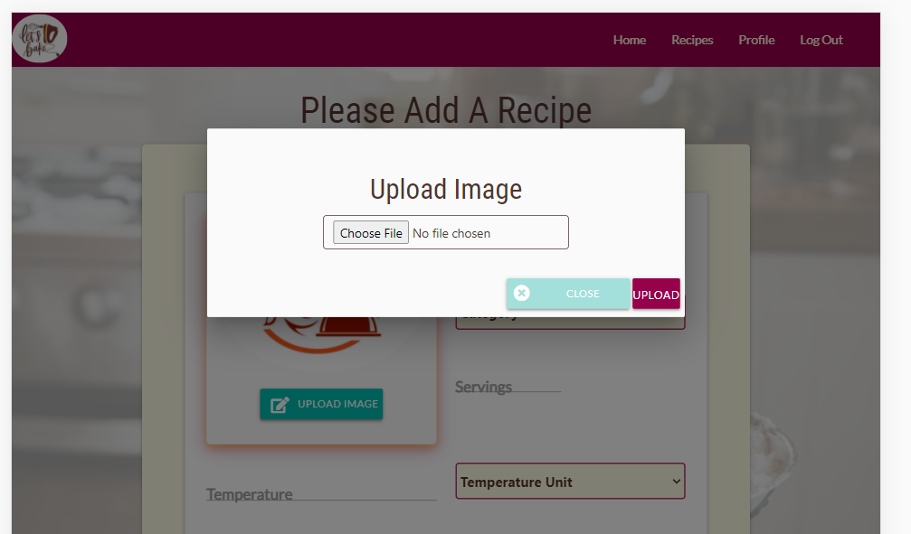
When the website user has chosen the image they want to use from the personal collection of images (or one they have downloaded) and clicked the upload button, an image is loaded to cloudinary and a new recipe record with the url is created in the recipe collection in MongoDB.
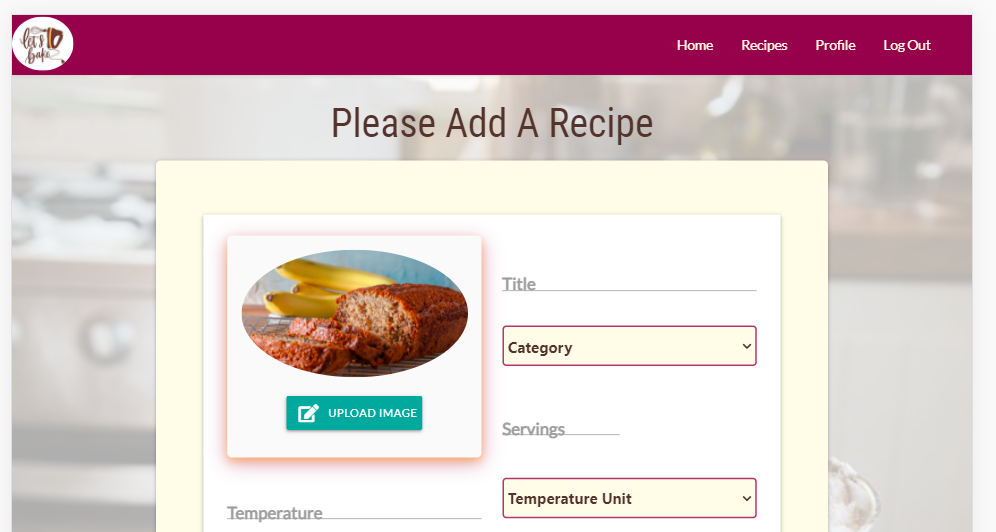
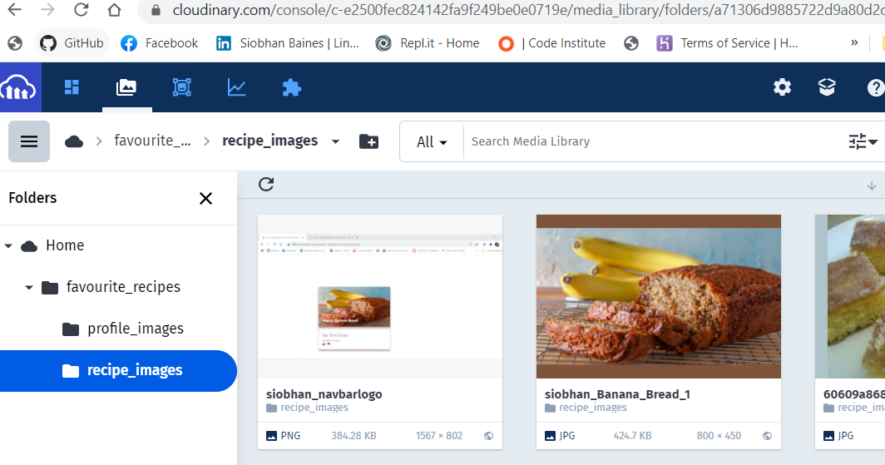
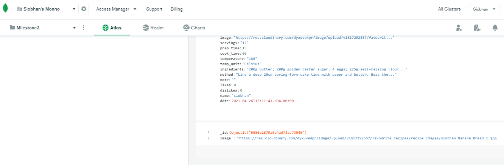
**Issues**
1. When entering the title of the recipe it did not allow an apostrophe.
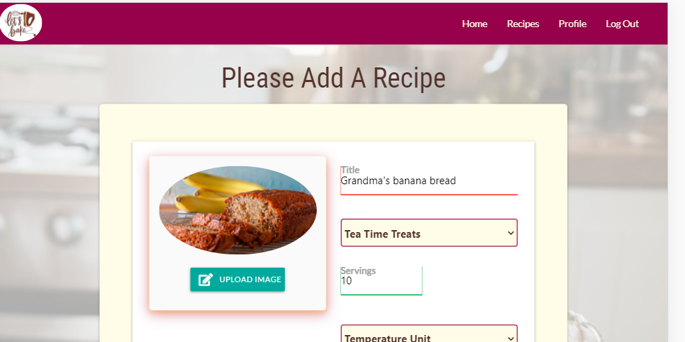
2. The 3 larger fields are `<textareaa>` elements which do not have the `pattern` attribute and will therefore allow any character. This is a risk because a hacker could easily enter lines of code that could cause serious damage to the database.
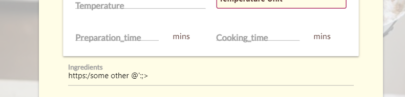 
**Resolution**
1. I modified the pattern on the input element `pattern="([^\s][A-z0-9À-ž&;,.'\s]+)" `
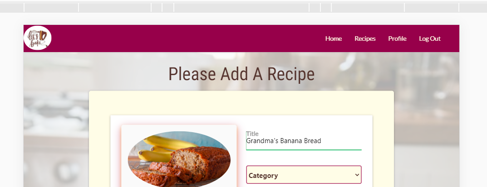
2. Although `<textarea>` feels like the correct type of element, to keep the database secure using the minimum amount of code I changed the elements `<input type="text"` and applied the above pattern. With more time I could potentially use some javascript keystroke listeners to test each character entered but I beleive that may impact response time.
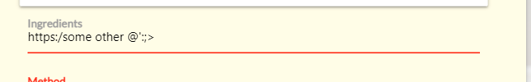

####    Edit Recipe Page
This page looks almost identical to the Add Recipe page.

**Issues**
1. When entering the temperature, "N/A" is not allowed but if the recipe does not need cooking not applicible is more appropriate than zero.
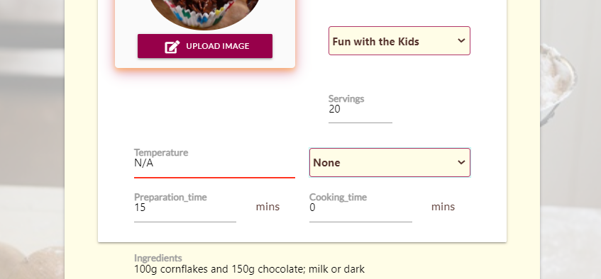
2. When adding the chocolate conflake buns recipe I wanted to put brackets around the "milk or dark chocolate" but this was not allowed with the pattern. The `Please match requested format` message appeared
**Resolution**
1. I modified the pattern on the input elements pattern to allow "N/A" for numbers`pattern="([^\s][0-9N/A]+)" `
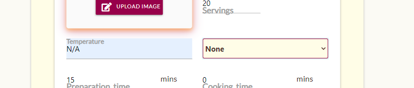
2.  I modified the pattern on the input elements pattern to allow brackets for the text type`pattern="([^\s][A-z0-9À-ž&;,./()'\s]+)" `

####    Manage Categories Page
The add category page is very simple and I could not find any issues.
 
#####   Delete Category
Only "admin" has access to delete categories on the Manage Category Page. On the below image the category "Test Cat1" can be seen.
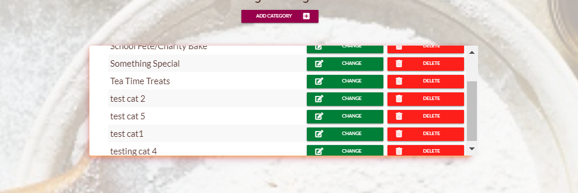
This image shows a recipe with the category "Test Cat1" in MongoDB.
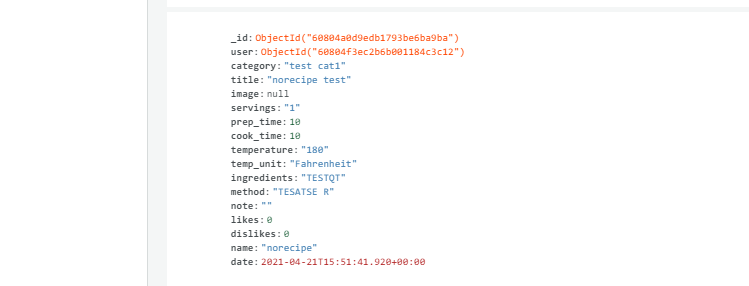
If '"admin" tries to delete this message they recieve a flash message telling them a recipe is using that category and the category is not deleted.
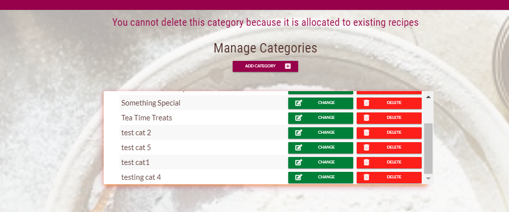
When a category is not attached to a recipe "admin" can delete it an will recieve a confirmation message once it has been deleted from the database.
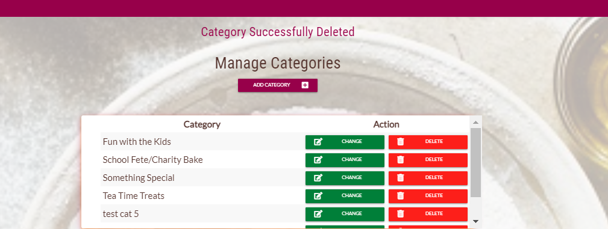 

####    Add Category Page
The add category page is very simple and I could not find any issues.

If the website user tries to add a duplicate category they see a flash message and the systems stops them.
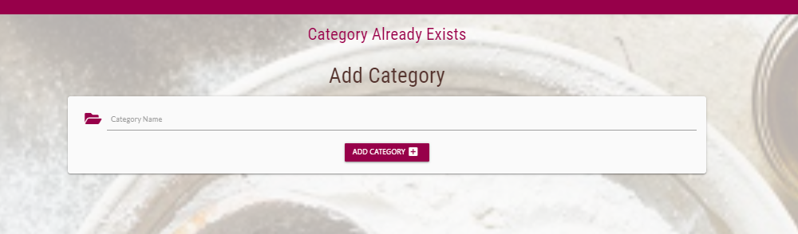

####    Edit Category Page
The update category page is very simple and I could not find any issues.
 

####    Contact Us Page
The below screen shots show the information pertaining to a message being created on the website via the contact us page.

It arriving in the designated email folder

And a confirmation email being recieved by the email address on the above screen shot

## Lighthouse Testing
### Home
####    Desktop
#####   Initial Test Results
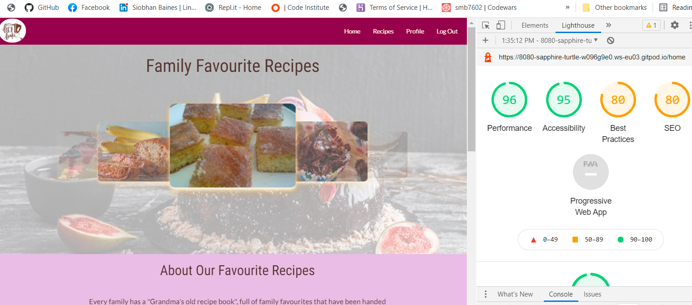
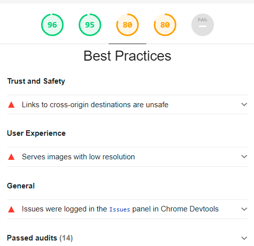
The links to my social media pages on `base.html` have the attribute `target="_blank"` which lighthouse says can "expose your site to performance and security issues". 
I have added `rel="noopener"` which should avoid the issues.
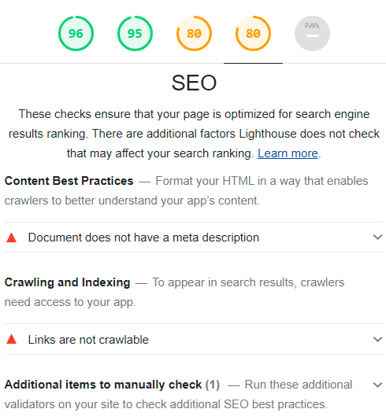
#####   Final Test Results
####    Mobile

## User Story Testing
### User Experience
######  User Story 1:   Recipe Details
**As a** visitor, 
**I want** to find some tasty and fun recipes
**So that** I can quickly and easily bake something tasty for family and friends
**Given** a visitor is interested in baking,
**When** they visit the site and open a recipe,
**Then** the recipe should have all the information needed to create the dish and be clear and easy to follow.
######  User Story 2:   Favourites
**As a** visitor, 
**I want** to know if other people like the recipe
**So that** I am confident I will enjoy it too
**Given** people have different likes and dislikes,
**When** eating food,
**Then** the site needs to have the ability to like or dislike the recipes and this information needs to be displayed clearly.
######  User Story 3:   Contact
**As a** visitor, 
**I want** to be able to contact the organisation
**So that** when I have a question or something is wrong
**When** using the site,
**Then** a confirmation email should be sent to the visitor.
######  User Story 4:   Registration/Login
**As a** visitor, 
**I want** to know my account is secure to me
**So that** I am confident noone else will be able to access my recipes
**Given** that passwords need to be create,
**When** a new account is registered,
**Then** the new password needs to be confirmed and encrypted to reduce the risk of hacking.
######  User Story 5:   Upload Profile
**As a** visitor with an account, 
**I want** to be able to add an avitar or image of myself or change my password
**So that** I know I am on my own profile and I can keep it more secure
**Given** it will make the account more personal,
**When** on the profile page
**Then** there needs to be an upload image and change password facility on the profile page.
######  User Story 6:   Add Recipes/Categories
**As a** visitor, 
**I want** to be able to add my own recipes and categories
**So that** I can share them with family and friends
**Given** the visitor has registered, creating a profile,
**When** logged in,
**Then** the visitor can create, read, update and delete recipes from a single location as well as having the ability to create, read and update categories if none of the current categories meet their requirements.
######  User Story 7:   Upload Images
**As a** visitor, 
**I want** to be able to upload an image of my recipes
**So that** other people and I can see the product without having to read
**Given** it is easier to scan images than words,
**When** looking for a recipe,
**Then** the add and edit recipe pages need to have an upload image fascility.
######  User Story 8:   Delete Account
**As a** visitor, 
**I want** to have the ability to delete my account and my recipes from the site
**So that** I know the site is compliant with GDPR
**Given** the recipes belong to each visitor when they are loaded onto the site,
**When** they wish to close their account,
**Then** the recipes must also be deleted because they could be classified as personal information.
